# 🏥 RedNorte — Backend

Sistema de gestión médica basado en microservicios Spring Boot, desplegado en AWS EKS con pipeline CI/CD automatizado mediante GitHub Actions.

---

## 📋 Tabla de contenidos

- [Arquitectura del Cluster AWS EKS](#arquitectura-del-cluster-aws-eks)
- [VPC y Configuración de Red](#vpc-y-configuración-de-red)
- [Nodos y Capacidad de Cómputo](#nodos-y-capacidad-de-cómputo)
- [Subredes y Tags](#subredes-y-tags)
- [Docker Hub](#docker-hub)
- [Manifiestos Kubernetes (k8s)](#manifiestos-kubernetes-k8s)
- [Pipeline CI/CD — GitHub Actions](#pipeline-cicd--github-actions)
- [Secrets y Credenciales](#secrets-y-credenciales)
- [SonarCloud — Análisis de Calidad](#sonarcloud--análisis-de-calidad)
- [Evidencias del Despliegue](#evidencias-del-despliegue)

---

## Arquitectura del Cluster AWS EKS

El backend de RedNorte está desplegado en **Amazon Elastic Kubernetes Service (EKS)** bajo el cluster `ClusterRedNorte` en la región `us-east-1`. La aplicación está compuesta por 7 microservicios Spring Boot orquestados dentro del namespace `rednorte`.

| Parámetro | Valor |
|---|---|
| Nombre del cluster | `ClusterRedNorte` |
| Región | `us-east-1` |
| Versión de Kubernetes | `v1.35` |
| Namespace | `rednorte` |
| Node Group | `GrupoNodosRedNorte` |
| IAM Role del cluster | `LabRole` |

### Microservicios desplegados

| Servicio | Puerto | Tipo de Service |
|---|---|---|
| `eureka-server` | 8761 | ClusterIP |
| `auth-service` | 8084 | ClusterIP |
| `user-service` | 8081 | ClusterIP |
| `appointment-service` | 8083 | ClusterIP |
| `notification-service` | 8086 | ClusterIP |
| `gateway-service` | 8082 | LoadBalancer |
| `bff-service` | 8085 | LoadBalancer |
| `rabbitmq` | 5672 / 15672 | ClusterIP |
| `redis` | 6379 | ClusterIP |

> 📸 **[Vista del cluster en AWS Console]**

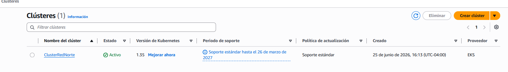

> 📸 **[Vista detallad del cluster en AWS Console]**

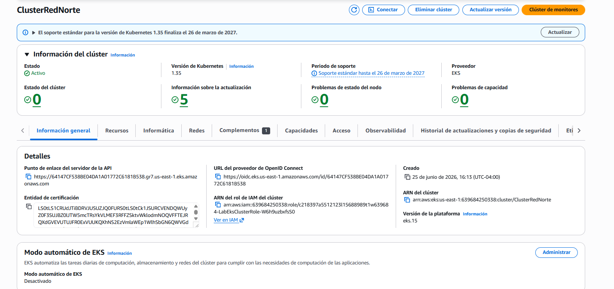


> 📸 **[Pods corriendo — kubectl get pods -n rednorte]**
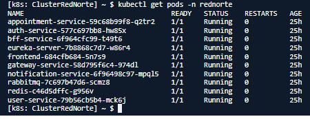


> 📸 **[Services y LoadBalancers — kubectl get services -n rednorte]**
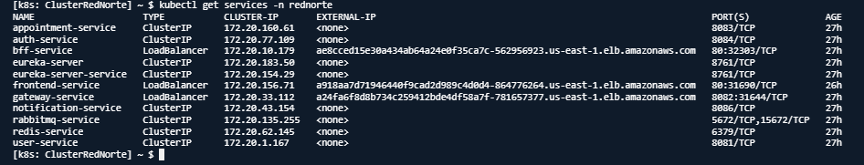

---

## VPC y Configuración de Red

La infraestructura de red está organizada dentro de una **VPC dedicada** con separación entre subredes públicas y privadas para garantizar el aislamiento y la seguridad.

```
VPC — 10.0.0.0/16 (us-east-1)
├── Subred pública  → Load Balancers (ALB)
│   ├── 10.0.0.0/24 (us-east-1a)
│   └── 10.0.1.0/24 (us-east-1b)
└── Subred privada  → Nodos EKS + Pods
    ├── 10.0.12.0/24 (us-east-1a)
    └── 10.0.25.0/24 (us-east-1b)
```

- **Subredes públicas**: exponen los Application Load Balancers al internet. Security Group permite tráfico entrante en puerto 80.
- **Subredes privadas**: alojan los nodos EC2 y todos los pods. No tienen IP pública. El tráfico de salida hacia servicios externos (Supabase) pasa por un NAT Gateway.

> 📸 **[VPC en AWS Console — VPC]**
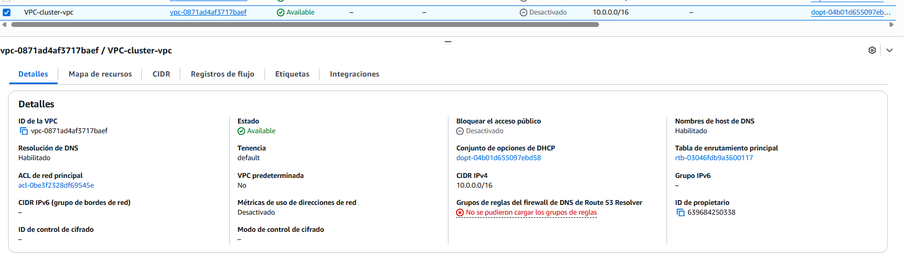

> 📸 **[Subredes públicas y privadas — VPC]**
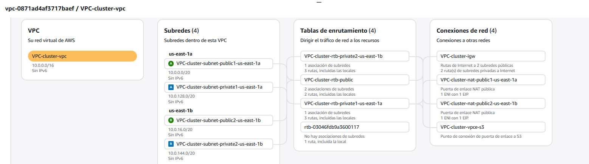

---

## Nodos y Capacidad de Cómputo

El cluster utiliza **instancias EC2** como nodos de trabajo organizadas en el Node Group `GrupoNodosRedNorte`.

| Parámetro | Valor |
|---|---|
| Tipo de nodo | EC2 (Amazon Linux 2) |
| Cantidad de nodos | 3 |
| Pods máximos por nodo | 17 |
| CPU por nodo | 2 vCPU (1930m allocatable) |
| Memoria por nodo | ~3.8 GB (3.2 GB allocatable) |
| Estrategia de actualización | `RollingUpdate` (maxSurge: 0, maxUnavailable: 1) |
| Historial de revisiones | `revisionHistoryLimit: 2` |

La estrategia `maxSurge: 0` evita que Kubernetes cree pods nuevos antes de eliminar los viejos, previniendo la saturación de nodos durante los despliegues.

> 📸 **[Node Group en AWS Console — EKS → Node Groups]**
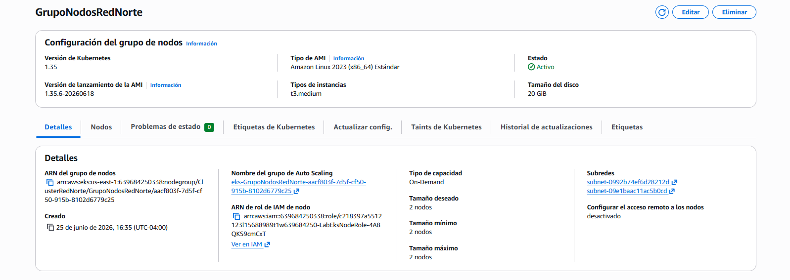
---

## Subredes y Tags

Para que EKS pueda crear Application Load Balancers automáticamente, las subredes requieren tags específicos.

### Tags obligatorios en subredes públicas

| Tag | Valor | Propósito |
|---|---|---|
| `kubernetes.io/role/elb` | `1` | Indica que la subred puede alojar ALBs externos |
| `kubernetes.io/cluster/ClusterRedNorte` | `shared` | Asocia la subred al cluster EKS |
| `Name` | `VPC-cluster-subnet-public1-*` | Identificador legible |

### Comando para agregar los tags

```bash
aws ec2 create-tags \
  --resources <subnet-id-1> <subnet-id-2> \
  --tags Key=kubernetes.io/role/elb,Value=1 \
         Key=kubernetes.io/cluster/ClusterRedNorte,Value=shared \
  --region us-east-1
```

> ⚠️ Sin estos tags, los Services de tipo `LoadBalancer` quedan en estado `<pending>` indefinidamente.

> 📸 **[Tags de la subred pública]**
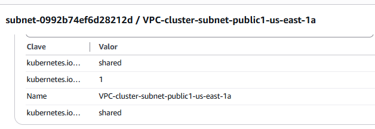
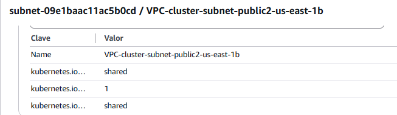

---

## Docker Hub

Las imágenes Docker de todos los microservicios se almacenan en **Docker Hub** bajo el usuario `gonzalo25u`, ya que el rol IAM del laboratorio no permite crear repositorios en Amazon ECR.

### Repositorios

| Repositorio | Imagen |
|---|---|
| `gonzalo25u/rednorte-eureka-server` | Servidor de descubrimiento Eureka |
| `gonzalo25u/rednorte-auth-service` | Servicio de autenticación JWT |
| `gonzalo25u/rednorte-user-service` | Gestión de usuarios |
| `gonzalo25u/rednorte-appointment-service` | Gestión de citas médicas |
| `gonzalo25u/rednorte-gateway-service` | API Gateway |
| `gonzalo25u/rednorte-bff-service` | Backend for Frontend |
| `gonzalo25u/rednorte-notification-service` | Servicio de notificaciones |

### Dockerfile del Backend

Cada microservicio usa la misma estructura de Dockerfile. La compilación con Maven ocurre en el runner de GitHub Actions, y el Dockerfile solo empaqueta el JAR ya compilado:

```dockerfile
FROM eclipse-temurin:21-jre
WORKDIR /app
COPY target/*.jar app.jar
ENTRYPOINT ["java", "-jar", "app.jar"]
```

Esta estrategia mantiene la imagen final liviana (~200 MB) al incluir solo el JRE y el JAR, sin herramientas de compilación.

> 📸 **[Repositorios en Docker Hub — hub.docker.com/u/gonzalo25u]**
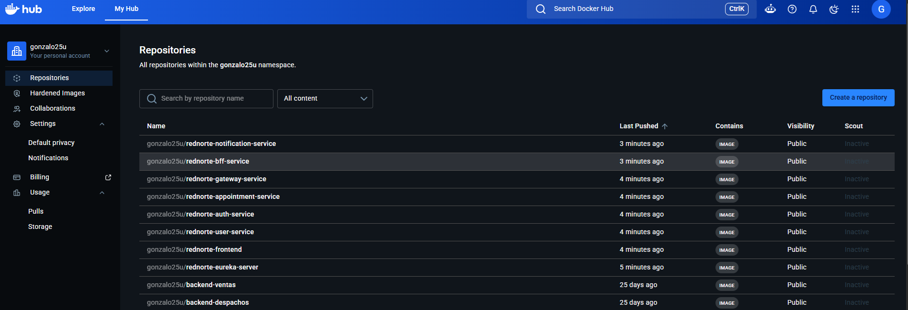
---

## Manifiestos Kubernetes (k8s)

Todos los manifiestos están versionados en el repositorio bajo la carpeta `k8s/`. A continuación se muestra el manifiesto del `bff-service` como ejemplo representativo:

```yaml
apiVersion: apps/v1
kind: Deployment
metadata:
  name: bff-service
  namespace: rednorte
  labels:
    app: bff-service
spec:
  replicas: 1
  revisionHistoryLimit: 2
  strategy:
    type: RollingUpdate
    rollingUpdate:
      maxSurge: 0
      maxUnavailable: 1
  selector:
    matchLabels:
      app: bff-service
  template:
    metadata:
      labels:
        app: bff-service
    spec:
      containers:
      - name: bff-service
        image: gonzalo25u/rednorte-bff-service:${IMAGE_TAG}
        ports:
        - containerPort: 8085
        envFrom:
        - configMapRef:
            name: rednorte-config   # variables no sensibles
        - secretRef:
            name: rednorte-secrets  # credenciales cifradas
---
apiVersion: v1
kind: Service
metadata:
  name: bff-service
  namespace: rednorte
spec:
  type: LoadBalancer
  selector:
    app: bff-service
  ports:
  - port: 80
    targetPort: 8085
```

### ConfigMap — variables no sensibles

```yaml
apiVersion: v1
kind: ConfigMap
metadata:
  name: rednorte-config
  namespace: rednorte
data:
  DB_HOST: "aws-1-sa-east-1.pooler.supabase.com"
  DB_PORT: "5432"
  DB_NAME: "postgres"
  RABBITMQ_HOST: "rabbitmq-service"
  RABBITMQ_PORT: "5672"
  EUREKA_URL: "http://eureka-server-service:8761/eureka/"
  GATEWAY_URL: "http://gateway-service:8082"
  SUPABASE_URL: "https://pfprycndvkdxuzvgjqol.supabase.co"
```

📸 **[Carpetas k8s]**
**[Frontend]**
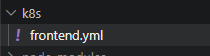
---

**[Backend]**
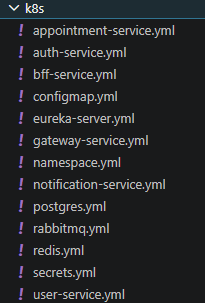
---


📸 **[Muestra con los manifiestos en el repositorio]**

**[frontend.yml]**
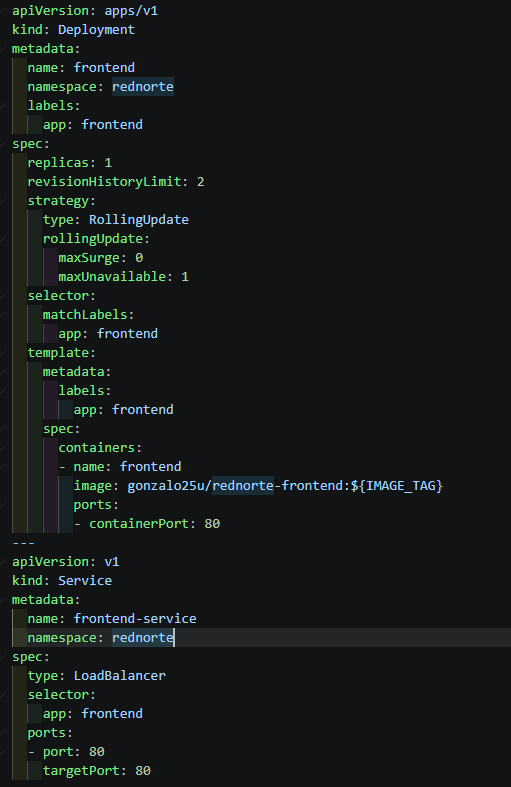
---

**[appointment-service.yml]**
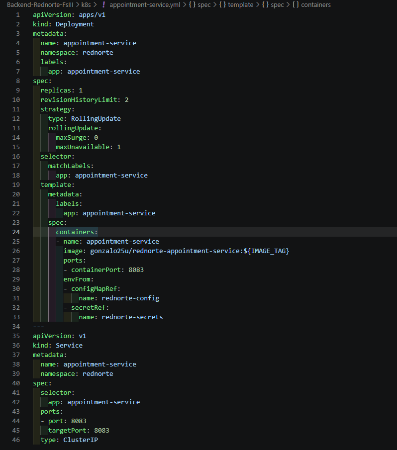
---


## Pipeline CI/CD — GitHub Actions

El pipeline se define en `.github/workflows/deploy.yml` y se activa automáticamente con cada `push` a la rama `master`.

### Flujo del pipeline

```
git push origin master
        ↓
1. Checkout código
2. Setup Java 21
3. Tests + Jacoco (appointment-service, user-service)
4. Análisis SonarCloud + Quality Gate
        ↓ (falla si Quality Gate no pasa)
5. Configurar credenciales AWS
6. Login a Docker Hub
7. mvn package + docker build + docker push (×7 servicios)
8. kubectl apply — namespace, configmap, secrets
9. kubectl apply — redis, rabbitmq
10. kubectl apply — microservicios con IMAGE_TAG
11. kubectl rollout status (verificación)
12. Métricas a CloudWatch (duración, éxito/fallo)
```

### Puntos clave

- El `IMAGE_TAG` usa el SHA del commit de Git, garantizando trazabilidad exacta entre código e imagen desplegada.
- El paso de SonarCloud usa `sonar.qualitygate.wait=true` — si el Quality Gate falla, el pipeline se detiene y no despliega.
- Los secrets en `secrets.yml` se reemplazan con `sed` antes de aplicar al cluster, nunca se guardan en texto plano en el repositorio.
- Las métricas de duración y éxito/fallo se envían a CloudWatch en el namespace `RedNorte/Deployments`.

📸 **[Pipeline exitoso en GitHub Actions — pestaña Actions]**

**[Frontend]**

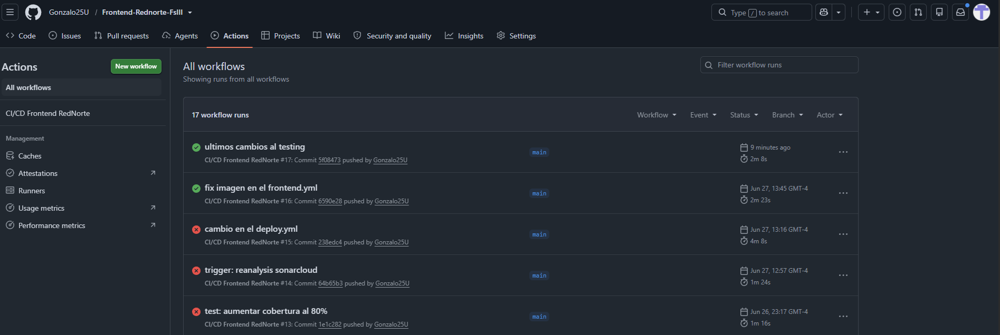
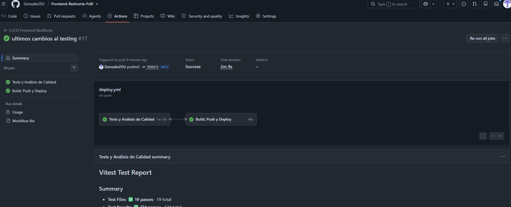

**[Backend]**
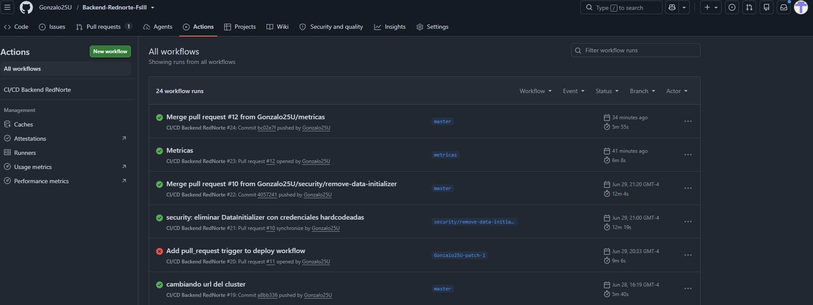
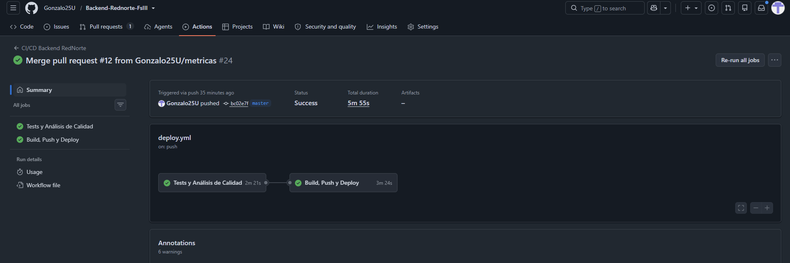


---

## Secrets y Credenciales

### GitHub Secrets

Ninguna credencial aparece en el código fuente. Todas están almacenadas como GitHub Secrets:

| Secret | Propósito |
|---|---|
| `AWS_ACCESS_KEY_ID` | Credencial IAM para autenticarse con AWS |
| `AWS_SECRET_ACCESS_KEY` | Llave secreta del IAM User |
| `AWS_SESSION_TOKEN` | Token de sesión temporal (laboratorio) |
| `DOCKERHUB_USERNAME` | Usuario de Docker Hub (`gonzalo25u`) |
| `DOCKERHUB_TOKEN` | Access Token de Docker Hub |
| `DB_USERNAME` | Usuario del pooler de Supabase |
| `DB_PASSWORD` | Contraseña de PostgreSQL en Supabase |
| `JWT_SECRET` | Clave para firmar tokens JWT |
| `SUPABASE_ANON_KEY` | Clave pública de Supabase |
| `SUPABASE_SERVICE_KEY` | Clave de servicio de Supabase |

### Kubernetes Secrets

El archivo `k8s/secrets.yml` en el repositorio contiene solo placeholders:

```yaml
stringData:
  DB_USERNAME: "${DB_USERNAME}"
  DB_PASSWORD: "${DB_PASSWORD}"
  JWT_SECRET: "${JWT_SECRET}"
```

El pipeline los reemplaza con `sed` antes de aplicar al cluster:

```bash
sed -i "s|\${DB_USERNAME}|${{ secrets.DB_USERNAME }}|g" k8s/secrets.yml
kubectl apply -f k8s/secrets.yml
```

Los pods leen las credenciales a través de `envFrom.secretRef`, que monta el Secret como variables de entorno en tiempo de ejecución.

## [Panel de GitHub Secrets (nombres visibles, valores ocultos)]

**[Frontend]**
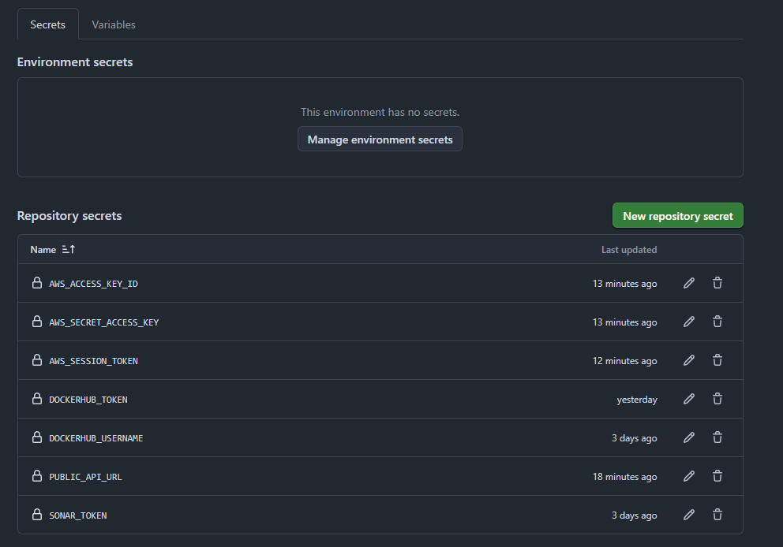
**[Backend]**
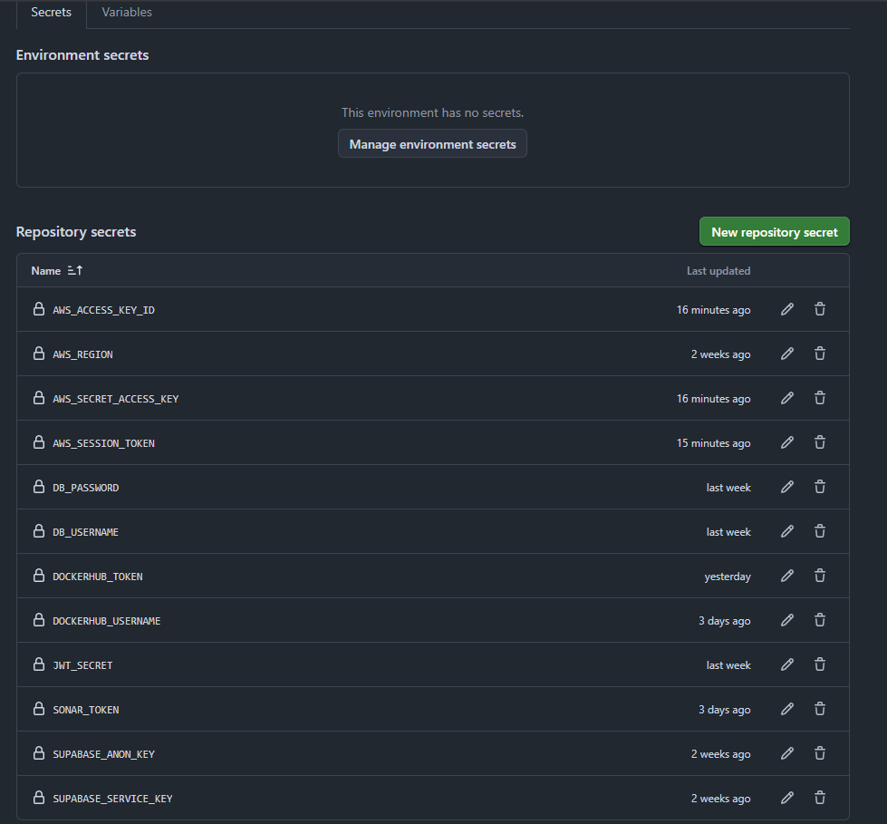

> 📸 **[kubectl get secret rednorte-secrets -n rednorte]**
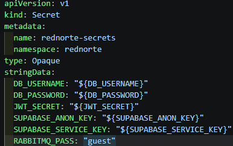

---

## SonarCloud — Análisis de Calidad

El análisis de calidad se integra en el pipeline como **gate obligatorio** antes del despliegue.

| Parámetro | Valor |
|---|---|
| Organización | `gonzalo25u` |
| Project Key | `Gonzalo25U_Backend-Rednorte-FsIII` |
| Servicios analizados | `appointment-service`, `user-service` |
| Cobertura mínima | 70% (configurado en Jacoco) |
| Quality Gate | Sonar way |

### Herramientas de testing

- **JUnit 5** — tests unitarios
- **Mockito** — mocking de dependencias
- **Jacoco** — reporte de cobertura de código

- **Vitest** — para cobertura del frontend

Si el Quality Gate falla, el pipeline se detiene con `exit code 3` y **no se despliega** ninguna imagen al cluster, garantizando que solo código que cumple los estándares de calidad llega a producción.

> 📸 **[Dashboard de SonarCloud]**

**[Frontend]**
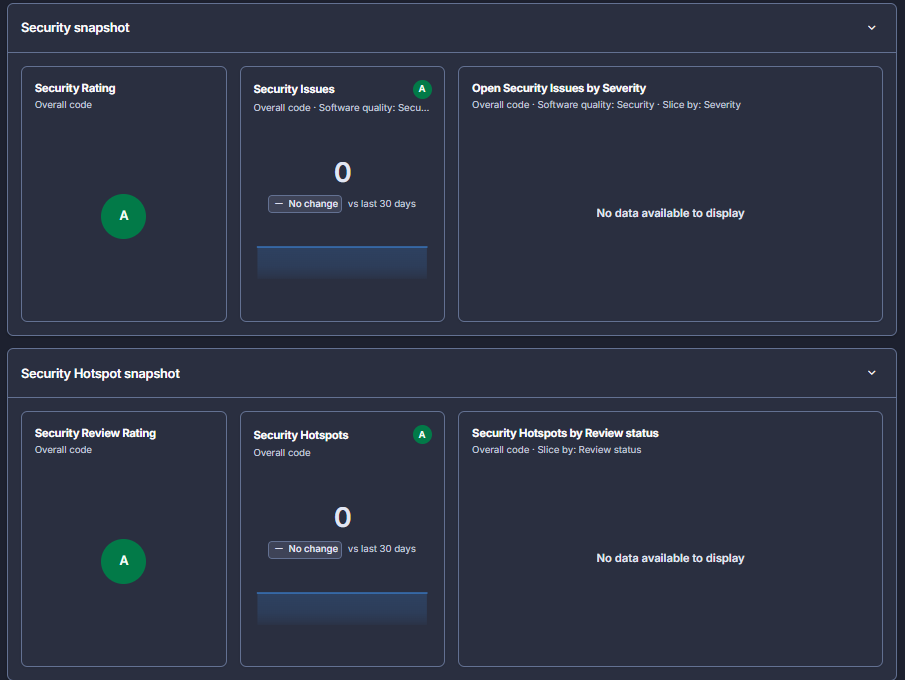
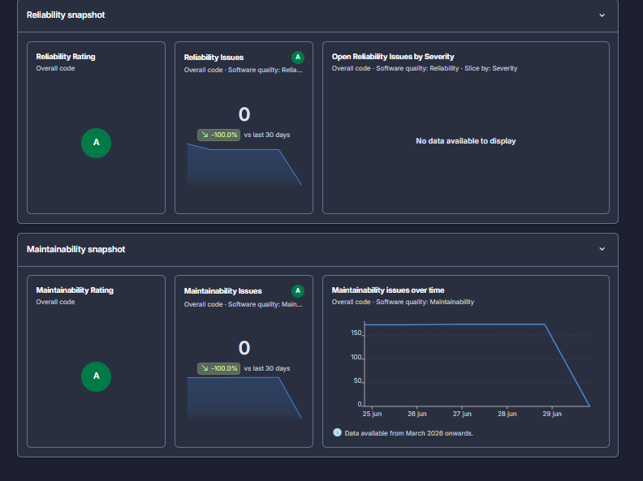

**[Backend]**
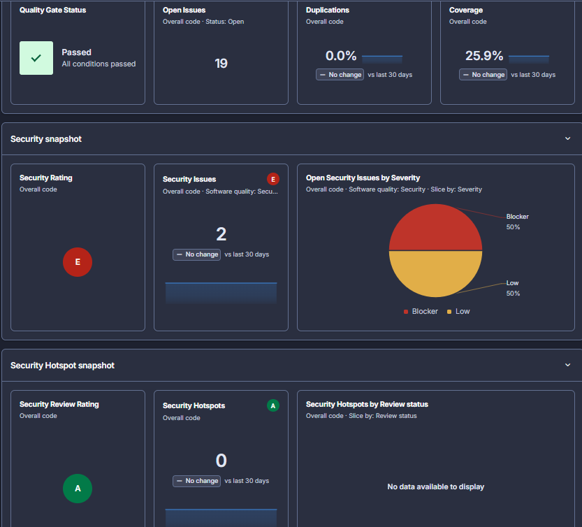
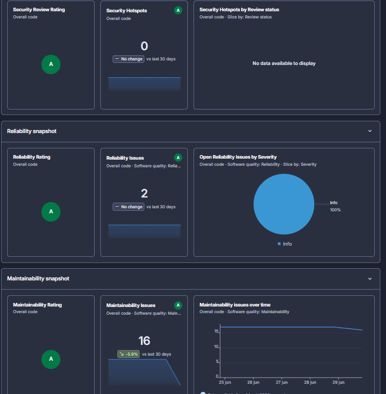


> 📸 **[CAPTURA 2: Reporte Graficado de Seguridad]**

**[Frontend]**
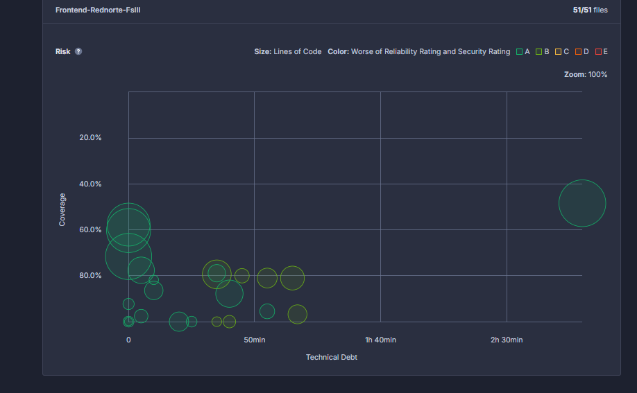

**[Backend]**
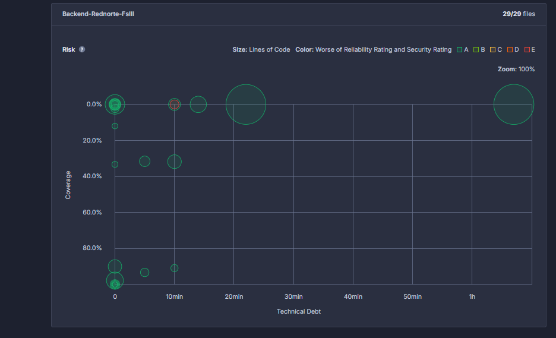
---

## Evidencias del Despliegue

### Estado final del cluster

```bash
kubectl get pods -n rednorte
```

| Pod | Estado | Reinicios |
|---|---|---|
| eureka-server | Running | 0 |
| auth-service (×2) | Running | 0 |
| bff-service (×2) | Running | 0 |
| gateway-service (×2) | Running | 0 |
| user-service (×2) | Running | 0 |
| appointment-service (×2) | Running | 0 |
| notification-service | Running | 0 |
| rabbitmq | Running | 0 |
| redis | Running | 0 |

### URLs públicas

| Servicio | URL |
|---|---|
| Gateway (API) | `http://a24fa6f8d8b734c259412bde4df58a7f-781657377.us-east-1.elb.amazonaws.com` |
| BFF | `http://ae8cced15e30a434ab64a24e0f35ca7c-562956923.us-east-1.elb.amazonaws.com` |

### Verificación de login exitoso

```bash
curl -X POST http://<gateway-url>/api/auth/login \
  -H "Content-Type: application/json" \
  -d '{"rut":"xxxxxxxx-x","password":"contraseña"}'

# Respuesta esperada:
# {"token":"eyJhbGciOiJIUzI1NiJ9..."}
```


> 📸 **[Respuesta exitosa del endpoint de login (token JWT)]**
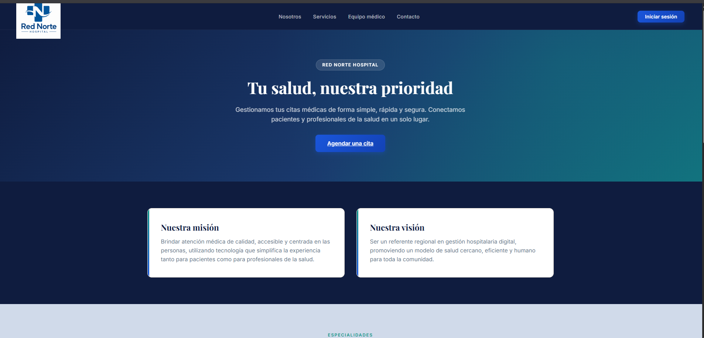

> 📸 **[Evidencias del despliegue]**


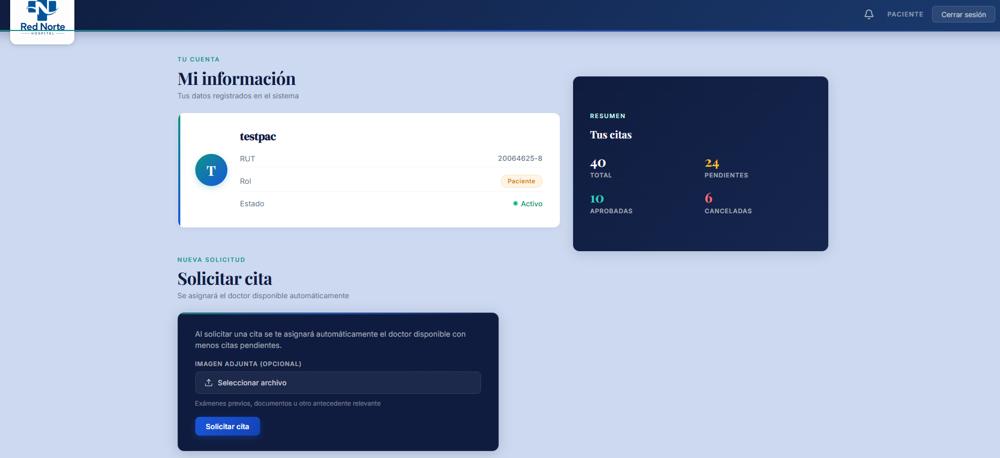
